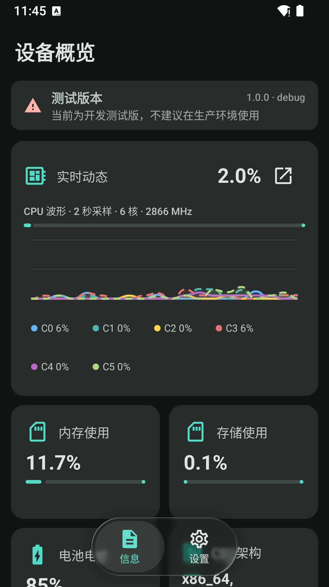
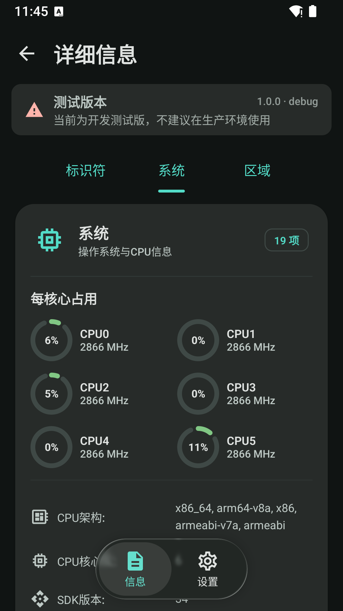
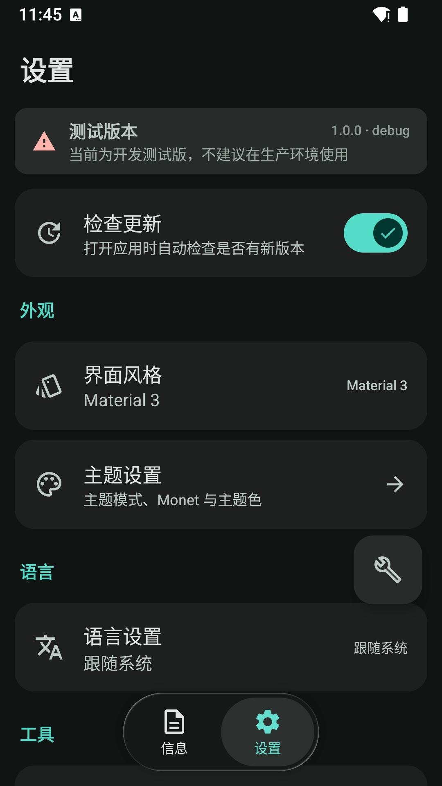
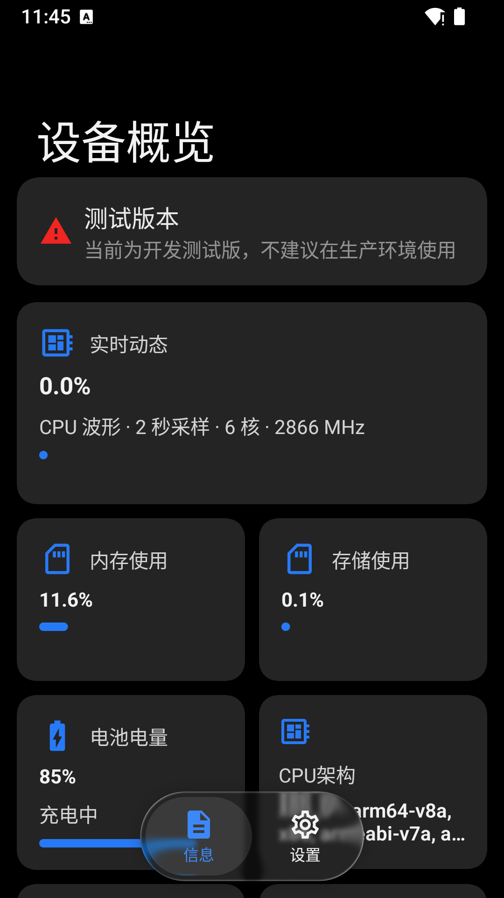
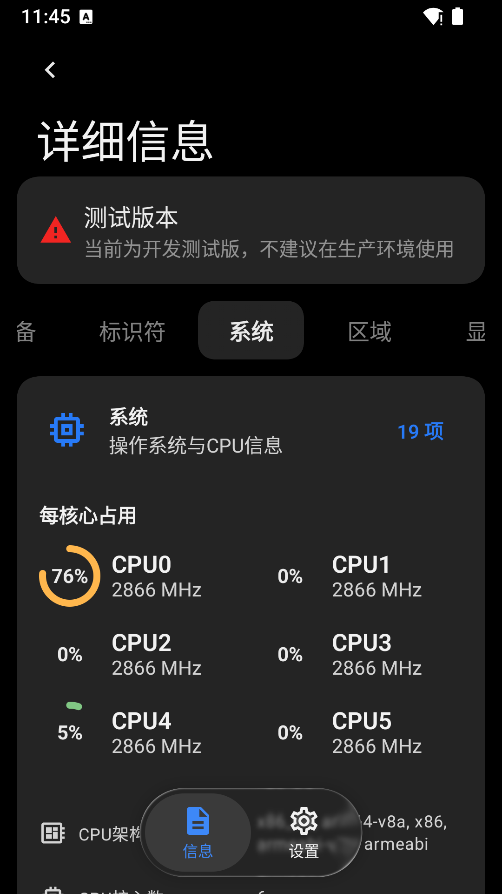
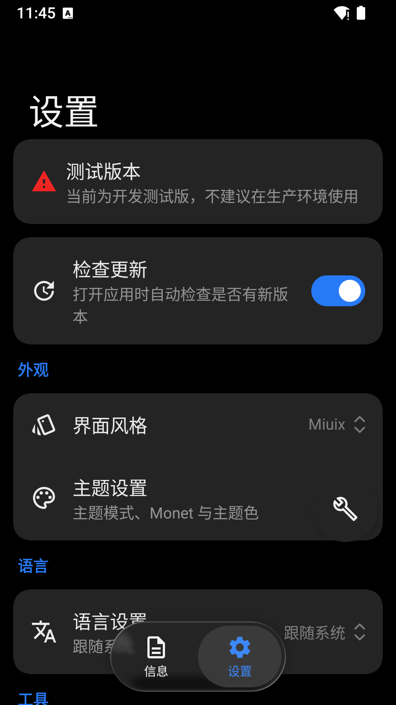

# DevInfo

<p align="center">
  <a href="README.md">简体中文</a> |
  <a href="README.en.md">English</a> |
  <a href="README.ja.md">日本語</a>
</p>

> このプロジェクトとドキュメントの一部は AI の支援により生成・整理されています。コード、設定、リリース内容は人による確認を前提としています。

| Material 3 デバイス情報 | Material 3 情報の詳細 | Material 3 設定 |
| --- | --- | --- |
|  |  |  |

| Miuix デバイス情報 | Miuix 情報の詳細 | Miuix 設定 |
| --- | --- | --- |
|  |  |  |

[](LICENSE)
[](https://developer.android.com)
[](https://github.com/FIOIU8/DevInfo/releases)

DevInfo は Kotlin と Jetpack Compose で構築した Android デバイス情報ビューアです。デバイス情報の収集、リアルタイムのハードウェア概要、カテゴリ別の詳細表示、テーマと言語設定、Magisk / KernelSU モジュールとしての情報エクスポートを提供します。

## 主な機能

### デバイス情報

- 識別子、デバイス、システム、地域、表示、ストレージ、バッテリー、ネットワーク、アプリの 9 分類に対応します。
- Android バージョン、SDK、ABI、カーネル、セキュリティパッチ、画面、メモリ/ストレージ、バッテリー、ネットワーク、センサー、インストール済みアプリの情報を収集します。
- 静的カードとリアルタイム指標をまとめた概要画面、プル・トゥ・リフレッシュ、カテゴリ別詳細画面を提供します。
- CPU 全体/コア別使用率、コア周波数、GPU 周波数/使用率、メモリ/ストレージ使用率、バッテリー状態を端末が対応する範囲で表示します。
- 動作状態、画面の明るさ、ストレージ読み取り速度、Wi-Fi 信号情報も利用可能な場合に表示します。

### エクスポートと更新

- 現在のデバイス情報を ZIP 形式の Magisk / KernelSU 端末偽装モジュールとしてエクスポートします。
- 保存前に最小限のエクスポートポリシーを選択できます。ZIP にはデバイス情報が含まれる可能性があり、フラッシュによってシステム動作が変わる場合があります。
- GitHub Releases で更新を確認し、リリースノートをアプリ内で表示します。ネットワーク障害はエラー状態として表示します。

### UI とローカライズ

- Material 3 と Miuix の UI スタイル。
- システム、ライト、ダーク、動的カラーの各モード、テーマカラー、パレット、表示倍率、ぼかし、フローティングナビゲーションを設定できます。
- 簡体字中国語、英語、日本語、およびカスタム BCP-47 locale タグに対応します。
- Android 14 以降の予測型戻るジェスチャー、ライト/ダーク対応 Splash、アプリ全体のプル・トゥ・リフレッシュに対応します。

## データの可用性

読み取れる項目は端末メーカー、Android バージョン、システムの制限によって異なります。個々の収集に失敗しても他の項目の表示は継続します。

一部の Android バージョンでは `/proc` の CPU 統計が制限されます。その場合、CPU 使用率は利用不可として表示し、読み取り可能な CPU トポロジーとコア周波数を表示します。利用できないデータを `0%` として表示することはありません。

## ダウンロードとビルド

### ダウンロード

- 正式版: [Releases](https://github.com/FIOIU8/DevInfo/releases)。
- テストビルド: [Actions](https://github.com/FIOIU8/DevInfo/actions) のワークフロー Artifacts から APK を取得します。

### 必要な環境

- Android Studio と Android SDK 37。
- JDK 21。Kotlin の JVM ターゲットは 11。
- 最低対応 Android: Android 13（API 33）。

### ローカルビルド

```bash
# Windows
gradlew.bat testDebugUnitTest
gradlew.bat ktlintCheck
gradlew.bat lintDebug
gradlew.bat assembleDebug

# Linux/macOS
./gradlew testDebugUnitTest
./gradlew ktlintCheck
./gradlew lintDebug
./gradlew assembleDebug
```

Debug APK は `app/build/outputs/apk/debug/` に出力されます。初回ビルドでは Gradle が依存関係をダウンロードします。

## 技術スタック

| 技術 | 現在の設定 |
| --- | --- |
| Kotlin | 2.4.0 |
| Jetpack Compose | BOM 2026.06.01 |
| Material 3 | Compose BOM で管理 |
| Miuix | 0.9.2 |
| Android Gradle Plugin | 9.1.0 |
| compileSdk / targetSdk | 37 |
| minSdk | 33（Android 13） |
| Java 互換性 | Java 11、Gradle toolchain 21 |

## プロジェクト構成

```text
DevInfo/
├── app/                 # アプリの入口、Manifest、パッケージング
├── core/                # モデル、CPU 解析、UI に依存しない基礎ロジック
├── data/                # 情報収集、監視、設定、更新、エクスポート
├── feature-main/        # メイン画面、概要、詳細、設定、About
├── ui/                  # Compose/Miuix テーマ、共通コンポーネント、Markdown
├── .github/workflows/   # CI 検証、APK ビルド、tag リリース
├── gradle/libs.versions.toml
├── LICENSE
└── README.ja.md
```

## アーキテクチャ解析

### モジュール依存関係

```text
app
├── feature-main ── data ── core
│                 └─────── ui ── core
├── data
├── ui
└── core
```

- **`app`** は唯一の Android application モジュールです。 `MainActivity` が収集、更新確認、設定保存、エクスポートの依存関係を組み立てます。
- **`feature-main`** は画面と `MainViewModel` を担当し、システム情報の読み取り処理を持たずに操作を調整します。
- **`data`** は `DeviceInfoCollector`、リアルタイム監視、設定、更新確認、モジュールエクスポートを提供します。
- **`core`** は `DeviceInfoItem`、`OverviewSnapshot`、CPU 解析、エクスポートポリシーなどの共有モデルを提供します。
- **`ui`** は Material 3/Miuix のテーマ、ナビゲーション、フィードバック、ぼかし、Markdown コンポーネントを提供します。

### 主なデータフロー

```text
Android API / sysfs / GitHub
             │
             ▼
          data 層
             │ DeviceInfoItem、OverviewSnapshot、StateFlow
             ▼
       MainViewModel
             │
             ▼
 feature-main 画面 ──> ui コンポーネント ──> Compose UI
```

`MainActivity` が依存関係を注入し、`MainViewModel` がバックグラウンドで静的情報とリアルタイム情報を読み込みます。画面はライフサイクルを考慮した `StateFlow` を購読します。`OverviewSnapshot` で概要全体を置き換えることで、リアルタイムカード間の不整合を抑えます。設定は監視可能な Flow で公開し、バッテリー Broadcast は `callbackFlow` に橋渡しします。`UpdateChecker` は `GitHubClient` とキャッシュ状態を使い、`ModuleExportHelper` は ZIP エントリを検証してからシステムファイルピッカーへ保存します。

## 権限とプライバシー

現在の Manifest で宣言している権限は次のとおりです。

| 権限 | 用途 |
| --- | --- |
| `INTERNET` | GitHub Releases の更新確認 |
| `ACCESS_NETWORK_STATE` | ネットワーク能力の確認 |
| `ACCESS_WIFI_STATE` | Wi-Fi 状態と信号関連情報の確認 |
| `NFC` | NFC 対応状況の確認 |

デバイス情報は画面表示と任意のモジュールエクスポートのために読み取られます。エクスポートした ZIP には識別子、ビルドフィンガープリント、セキュリティパッチが含まれる可能性があるため、共有またはフラッシュ前に内容を確認してください。更新確認を有効にした場合のみ GitHub にアクセスします。

## CI とリリース

- `build.yml` は `main`/`test` への push、Pull Request、手動実行で単体テスト、ktlint、Android lint、Debug APK ビルドを実行します。
- 手動実行ではバージョン名と `debug`/`release` の署名種別を指定でき、Artifacts に成果物をアップロードします。
- `release.yml` は `v*` tag で起動し、品質検証後に Secrets で署名して Draft Release を作成します。
- リリース署名には `KEYSTORE_BASE64`、`KEYSTORE_PASSWORD`、`KEY_ALIAS`、`KEY_PASSWORD` が必要です。キーストアやパスワードをコミットしないでください。

## コントリビューション

1. リポジトリを Fork して機能ブランチを作成します。
2. コードまたはドキュメントを更新し、必要なテストを追加します。
3. `testDebugUnitTest`、`ktlintCheck`、`lintDebug` をローカルで実行します。
4. 変更対象モジュールと検証結果を記載して Pull Request を作成します。

問題は [Issues](https://github.com/FIOIU8/DevInfo/issues) から報告してください。

## ライセンス

このプロジェクトは [GPL-3.0](LICENSE) の下で公開されています。

## リンク

- [ソースコード](https://github.com/FIOIU8/DevInfo)
- [Releases](https://github.com/FIOIU8/DevInfo/releases)
- [Actions](https://github.com/FIOIU8/DevInfo/actions)
- [Issues](https://github.com/FIOIU8/DevInfo/issues)
