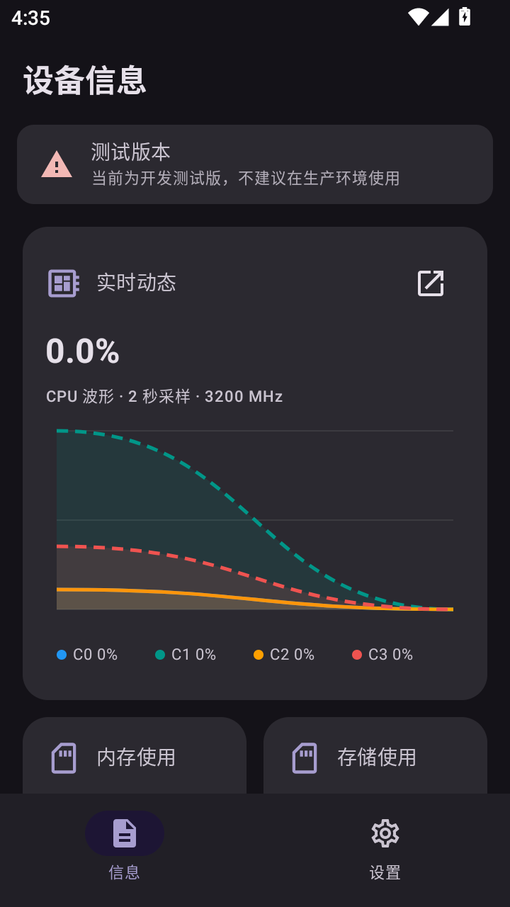
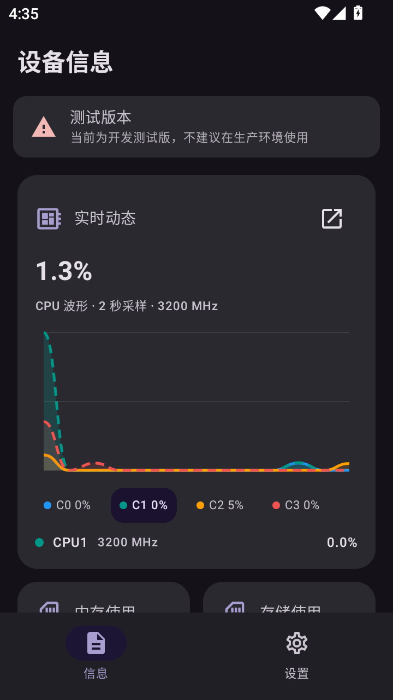

# 📱 DevInfo - 设备信息查看器

<p align="center">
  <a href="README.md">简体中文</a> | <a href="README.en.md">English</a> | <a href="README.ja.md">日本語</a>
</p>

> 🤖 本项目由 AI 辅助生成。

[](LICENSE)
[](https://developer.android.com)
[](https://github.com/FIOIU8/DevInfo/stargazers)
[](https://github.com/FIOIU8/DevInfo/releases)

一款基于 Kotlin + Jetpack Compose 的 Android 设备信息查看工具，能够全面展示设备的硬件规格、系统状态、网络信息和电池数据，并支持将设备信息导出为 Magisk/KernelSU 模块。

## 📸 应用截图

<p align="center">
  
  &nbsp;&nbsp;
  
</p>

## ✨ 功能特性

### 🔍 设备信息

- **全面采集** - 50+ 项设备信息，覆盖 9 大分类（标识符、设备、系统、区域、显示、存储、电池、网络、应用）
- **实时仪表板** - CPU/GPU 频率与占用率、内存/存储使用率、电池状态的实时动态展示
- **多核心 CPU 监控** - 每个 CPU 核心的频率和使用率，带 Canvas 波形图可视化
- **硬件传感器** - 运动状态检测、屏幕亮度、实时存储读速、Wi-Fi 信号强度
- **安全检测** - 安全补丁日期、锁屏密码状态、USB 调试状态（开启时显示警告）

### 🛠️ 工具功能

- **Magisk/KernelSU 模块导出** - 将当前设备信息导出为可刷入的机型模拟模块 ZIP 包，支持双环境安装脚本
- **自动更新检查** - 通过 GitHub Releases API 检测新版本（12 小时缓存）
- **Markdown 渲染** - 更新日志支持 Markdown 格式渲染

### 🎨 界面与交互

- **Material 3 设计** - 使用 Material 3 + Material You 动态取色（Android 12+），支持 Material 3 Expressive API
- **6 种主题模式** - 跟随系统 / 浅色 / 深色 + 动态颜色开关
- **8 种主题颜色** - 默认、红、橙、绿、青、紫、粉、深色
- **多语言支持** - 🇨🇳 中文、🇬🇧 英文、🇯🇵 日文 + 自定义 locale 输入
- **预测性返回手势** - 支持 Android 14+ 系统级返回动画
- **下拉刷新** - PullToRefreshBox 全局支持
- **Splash 启动屏** - 适配深色/浅色模式

## 📥 下载

[](https://github.com/FIOIU8/DevInfo/releases)

- 🧪 **最新构建**：前往 [Actions](https://github.com/FIOIU8/DevInfo/actions) 页面，点击最新工作流，在 **Artifacts** 中下载 APK
- 🚀 **正式发布**：前往 [Releases](https://github.com/FIOIU8/DevInfo/releases) 页面下载正式版本

## 🚀 GitHub Actions 自动构建

### 触发方式

| 触发方式 | 分支 | 签名类型 | 版本名 | 创建 Release |
|---------|------|---------|--------|-------------|
| Push 到 `main`/`test` | main, test | debug | `dev-{commit}` | ❌ |
| 手动触发 - debug | 任意 | debug | 自定义 | 可选 |
| 手动触发 - release | 任意 | release | 自定义 | 可选 |

### 手动构建

1. 进入 GitHub 仓库 → **Actions** → **Build and Release**
2. 点击 **Run workflow**，填写参数（版本名、签名类型、Release 选项）
3. 构建完成后在 Artifacts 或 Releases 中获取 APK

### 🔐 配置 Release 签名

> ⚠️ debug 构建无需此步骤，可直接安装测试。

Fork 后如需 release 签名，在仓库 **Settings → Secrets and variables → Actions → Repository secrets** 中添加：

| Secret 名称 | 说明 |
|------------|------|
| `KEYSTORE_BASE64` | 密钥库文件的 Base64 编码 |
| `KEYSTORE_PASSWORD` | 密钥库密码 |
| `KEY_ALIAS` | 密钥别名 |
| `KEY_PASSWORD` | 密钥密码 |

```bash
# 生成密钥库
keytool -genkey -v -keystore release.keystore -alias devinfo -keyalg RSA -keysize 2048 -validity 10000

# Base64 编码 (Windows PowerShell)
[Convert]::ToBase64String([IO.File]::ReadAllBytes("release.keystore")) | Out-File -FilePath release.keystore.base64 -NoNewline

# Base64 编码 (Linux/Mac)
base64 -w 0 release.keystore > release.keystore.base64
```

## 🛠️ 技术栈

| 技术 | 版本 | 说明 |
|------|------|------|
| Kotlin | 2.3.21 | 开发语言 |
| Jetpack Compose | BOM 2026.06.01 | 声明式 UI |
| Material 3 | 1.5.0-alpha23 | MD3 + Material You + Expressive API |
| AGP | 9.1.0 | Android 构建插件 |
| compileSdk / targetSdk | 37 | Android SDK |
| minSdk | 30 (Android 11) | 最低支持版本 |

## 📁 项目结构

```
DevInfo/
├── .github/workflows/build.yml          # 🔄 CI/CD 工作流
├── app/src/main/java/com/fioiu8/devinfo/
│   ├── MainActivity.kt                  # 🚀 入口 Activity
│   ├── DeviceInfoCollector.kt           # 📊 核心设备信息采集器 (50+ 项)
│   ├── LiveHardwareMonitor.kt           # 📡 实时硬件传感器监控
│   ├── CpuUsageSampler.kt              # ⚡ CPU 使用率采样 (2秒间隔)
│   ├── BatteryObserver.kt              # 🔋 电池状态监听 (callbackFlow)
│   ├── UpdateChecker.kt                # 🔄 GitHub 版本更新检查
│   ├── GitHubClient.kt                 # 🌐 GitHub API 客户端
│   ├── DeviceIdManager.kt              # 🆔 设备唯一标识管理
│   ├── ModuleExportHelper.kt           # 📦 Magisk 模块导出
│   ├── ThemePreferences.kt             # 🎨 主题偏好存储
│   ├── LanguagePreferences.kt          # 🌐 语言偏好存储
│   ├── model/AppModels.kt             # 📋 数据模型定义
│   └── ui/
│       ├── MainScreen.kt              # 📱 主屏幕 (导航+编排)
│       ├── DeviceInfoOverviewPage.kt   # 📊 总览仪表板 (实时波形图)
│       ├── DeviceInfoPage.kt           # 📋 分类详情浏览
│       ├── SettingsPage.kt            # ⚙️ 设置页面
│       ├── AboutPage.kt               # ℹ️ 关于页面
│       ├── MarkdownRenderer.kt        # 📝 Markdown 渲染器
│       ├── AppComponents.kt           # 🧩 通用 UI 组件
│       ├── AppDialogs.kt              # 💬 对话框组件
│       └── theme/                      # 🎨 Material 3 主题
├── app/src/main/res/
│   ├── values/strings.xml             # 🇨🇳 中文 (默认)
│   ├── values-en/strings.xml          # 🇬🇧 英文
│   └── values-ja/strings.xml          # 🇯🇵 日文
└── gradle/libs.versions.toml          # 📦 依赖版本目录
```

## 🏗️ 架构设计

- **Provider 模式** - `DeviceInfoCollector` 通过 supplier 函数列表逐项采集信息，单项失败不影响整体
- **响应式状态** - `StateFlow` + `collectAsState` 驱动主题、语言、电池等状态的实时更新
- **callbackFlow** - `BatteryObserver` 将 BroadcastReceiver 桥接为 Kotlin Flow
- **Mutex 保护** - 防止并发重载设备信息
- **WeakReference** - `CpuUsageSampler` 使用弱引用防止内存泄漏
- **Snapshot 模式** - `OverviewSnapshot` 聚合所有实时指标，整体替换避免碎片化状态

## 🔐 权限说明

本应用的所有 `uses-feature` 均设置为 `required="false"`，不影响不支持对应功能的设备安装运行。

| 权限 | 用途 |
|------|------|
| `ACCESS_NETWORK_STATE` / `ACCESS_WIFI_STATE` | 🌐 网络类型与 Wi-Fi 信号检测 |
| `INTERNET` | 🌍 GitHub API 调用（更新检查） |
| `BLUETOOTH` / `BLUETOOTH_CONNECT` / `BLUETOOTH_SCAN` | 📶 蓝牙状态检测 |
| `NFC` | 📡 NFC 功能检测 |
| `CAMERA` | 📷 摄像头数量检测 |
| `READ_PHONE_STATE` | 📞 运营商信息 |
| `READ_EXTERNAL_STORAGE` / `READ_MEDIA_*` | 💾 存储信息读取 |

在 Android 12+ 上，`BLUETOOTH_SCAN` 不需要位置权限；但为支持较低 API 级别的蓝牙扫描，仍可能需要位置权限。

## 🔗 快捷链接

| 资源 | 链接 |
|------|------|
| 📦 源代码 | [Code](https://github.com/FIOIU8/DevInfo) |
| 📋 问题反馈 | [Issues](https://github.com/FIOIU8/DevInfo/issues) |
| 🔀 合并请求 | [Pull Requests](https://github.com/FIOIU8/DevInfo/pulls) |
| 📢 发布版本 | [Releases](https://github.com/FIOIU8/DevInfo/releases) |
| 🔄 持续集成 | [Actions](https://github.com/FIOIU8/DevInfo/actions) |
| 📊 项目看板 | [Projects](https://github.com/FIOIU8/DevInfo/projects) |

## 🤝 贡献者

[](https://github.com/FIOIU8/DevInfo/graphs/contributors)

欢迎提交 Issue 和 Pull Request！

1. Fork 本项目
2. 创建功能分支 (`git checkout -b feature/AmazingFeature`)
3. 提交更改 (`git commit -m 'feat: Add some AmazingFeature'`)
4. 推送到分支 (`git push origin feature/AmazingFeature`)
5. 打开 Pull Request

推荐使用 [Conventional Commits](https://www.conventionalcommits.org/) 前缀：`feat:`、`fix:`、`docs:`、`style:`、`refactor:`、`perf:`、`test:`、`chore:`、`ci:`。

## 📄 开源协议

本项目基于 [GNU 通用公共许可证第 3 版或更高版本（GPL-3.0-or-later）](LICENSE) 开源。

## 🙏 致谢

- [Material 3](https://developer.android.com/jetpack/compose/designsystems/material3) - Material Design 3 设计系统
- [Jetpack Compose](https://developer.android.com/jetpack/compose) - 现代 Android UI 工具包
- [MIUIX](https://github.com/compose-miuix-ui/miuix) - UI
- [KernelSU-Style-UI-Kit](https://github.com/chenaizhang/KernelSU-Style-UI-Kit) - UI 框架
- 所有贡献者和用户

---

> ⚡ 通过 GitHub Actions 自动构建的版本为开发测试版，建议测试使用。正式版本请从 [Releases](https://github.com/FIOIU8/DevInfo/releases) 页面下载。

<p align="center">
  <a href="https://github.com/FIOIU8/DevInfo">
    
  </a>
</p>

<p align="center">
  <a href="https://github.com/FIOIU8/DevInfo">
    
  </a>
</p>
